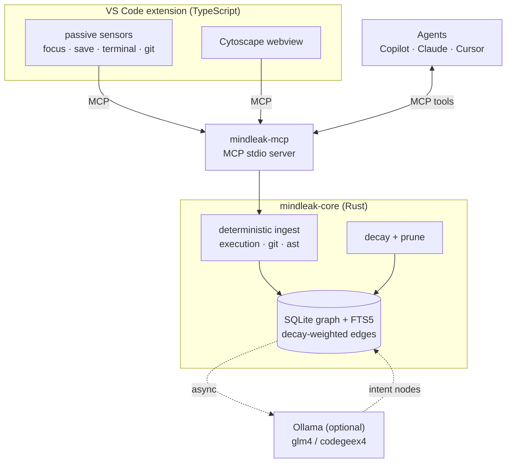

<p align="center">
  
</p>

# MindLeak

**A local, decay-weighted context graph brain for coding agents.**

MindLeak is a **Temporal Context Graph Engine (TCGE)** that turns raw developer
telemetry (terminal runs, git commits, file symbols) into a directional knowledge
graph whose edges **decay on an exponential half-life**, so stale context fades
instead of drowning every query in historical noise. It ships as:

- a **Rust core engine** ([`mindleak-core`](crates/mindleak-core)) — SQLite graph +
  FTS5, decay engine, zero-token deterministic ingestion, optional local-LLM
  consolidation;
- a **Rust MCP server** ([`mindleak-mcp`](crates/mindleak-mcp)) — exposes the graph
  to Copilot / Claude / Cursor / CLI agents over stdio;
- a **VS Code extension** ([`editors/vscode`](editors/vscode)) — passive editor,
  shell-execution, and Git sensors plus a live Cytoscape graph visualizer.

It is a complete, from-scratch replacement for flat log / vector-only agent
memory. See [`docs/SPEC.md`](docs/SPEC.md) for the full design and
[`docs/`](docs/) for architecture and development guides.

> **Zero-token write path.** Ingestion uses pure pattern matching (regex + path +
> exit code) — no LLM tokens. An optional local Ollama model only runs
> asynchronously to consolidate noise into high-level intent nodes.

**New here?** → **[Quickstart](docs/QUICKSTART.md)** (running in minutes) ·
**[Usage guide](docs/USAGE.md)** (how an agent uses the tools).

---

## Where everything is

| I want to… | Go to |
|---|---|
| **Get running fast** | **[docs/QUICKSTART.md](docs/QUICKSTART.md)** |
| **Learn how to use the tools** | **[docs/USAGE.md](docs/USAGE.md)** |
| Understand the design | [docs/SPEC.md](docs/SPEC.md) · [docs/ARCHITECTURE.md](docs/ARCHITECTURE.md) |
| Understand the *intent plane* (spec brain) | [docs/SPEC-INTENT.md](docs/SPEC-INTENT.md) · [ADR-0004](docs/adr/0004-intent-plane-spec-brain.md) |
| Set up & run locally | [DEVELOPERS.md](DEVELOPERS.md) |
| Contribute a change | [docs/CONTRIBUTING.md](docs/CONTRIBUTING.md) |
| Constraints for AI agents | [AGENTS.md](AGENTS.md) |
| Know *why* it's shaped this way | [RATIONALE.md](RATIONALE.md) · [docs/adr/](docs/adr/) |
| See what changed | [CHANGELOG.md](CHANGELOG.md) |
| Report a vulnerability | [SECURITY.md](SECURITY.md) |
| Know who owns what | [CODEOWNERS](CODEOWNERS) |

---

## Architecture



---

## Build

Requires Rust 1.75+, Node 18+, and VS Code 1.93+ for the extension.

```bash
# Both MCP servers
cargo build --release --locked -p mindleak-mcp -p lodestar-mcp

# Run the test suite
cargo test

# VS Code extension
cd editors/vscode
npm install
npm run compile
```

The server binaries land at `target/release/mindleak-mcp` and
`target/release/lodestar-mcp` (with `.exe` on Windows).

For the full local workflow (lint, format, pre-commit, CI), see
[`DEVELOPERS.md`](DEVELOPERS.md).

---

## Download

Tagged [GitHub Releases](https://github.com/monk-eee/MindLeak/releases) provide
one archive containing both MCP servers for each supported platform:

| Archive suffix | Platform |
|---|---|
| `windows-x64` | Windows x64 |
| `linux-x64` | Linux x64 (glibc) |
| `macos-x64` | macOS Intel |
| `macos-arm64` | macOS Apple Silicon |

Verify the archive against the release's `SHA256SUMS` and signed GitHub artifact
attestation, extract it, then run `node /path/to/extracted/install.mjs` from a
workspace. The dependency-free Node 20+ installer smoke-tests and registers both
servers without overwriting unrelated MCP entries. Each platform also publishes
a targeted VSIX with both native servers included. The binaries are not OS
publisher-signed, so the operating system may show a warning. Preview versions
use tags such as `v0.1.0-preview.1`.

Measured outcomes, supported language/platform matrices, and limitations:
[`docs/RELEASE-NOTES.md`](docs/RELEASE-NOTES.md).

---

## Run the MCP server

```bash
# Uses MINDLEAK_DB if set, else <cwd>/.mindleak/graph.db
MINDLEAK_DB="$PWD/.mindleak/graph.db" ./target/release/mindleak-mcp
```

It speaks newline-delimited JSON-RPC 2.0 (MCP) on stdio.

### Register with an MCP client (VS Code / Copilot example)

`.vscode/mcp.json`:

```json
{
  "servers": {
    "mindleak": {
      "command": "${workspaceFolder}/target/release/mindleak-mcp",
      "env": { "MINDLEAK_DB": "${workspaceFolder}/.mindleak/graph.db" }
    }
  }
}
```

---

## MCP tools

| Tool | Purpose |
|---|---|
| `graph_multi_hop_query` | Traverse N hops from a seed node/phrase, decay-filtered. |
| `get_impact_radius` | Blast radius of editing a file/symbol. |
| `record_architectural_decision` | Persist a decision as a linked intent node. |
| `ingest_execution` | Command + exit code → execution/modified/failed_on edges. |
| `ingest_commit` | Commit → intent node + refactored edges + rationale. |
| `ingest_file` | File → artifact + extracted symbols (`contains`). |
| `boost_entity` | Record node focus for recency views without rewriting evidence. |
| `graph_snapshot` | Subgraph for visualization. |
| `prune_graph` | Surface near-expiry proven signal for consolidation, then purge decayed noise and unreferenced stubs. |
| `graph_stats` | Node / active-edge counts. |
| `export_graph` | Complete active graph JSON with fully derived edge weights (not a backup). |
| `backup_database` | Create an integrity-checked online SQLite backup of the memory plane. |
| `reset_database` | Clear regenerable memory only with the exact `RESET MINDLEAK` token. |
| `consolidate_session` | Optional: compress raw logs into one intent node via a local Ollama model. |
| `consolidate_signal` | Optional: consolidate queued proven signal, persist provenance links, then acknowledge raw evidence. |
| `list_agents` | Roster of agents + their active observation counts (attribution). |
| `evidence_for` | Bounded, provenance-bearing evidence bundle from an agent's attributed executions/commits in a work window (ADR-0009). |
| `index` | Optional: embed nodes lacking a current vector via a local `/v1/embeddings` server (ADR-0008). |
| `recall` | Optional: nearest node ids by cosine similarity — entry points to *seed* `graph_multi_hop_query`. |
| `telemetry_snapshot` | Observability record (ADR-0010): per-tool call counts, errors, latency, and recent invocations from the durable audit trail. |

---

## Intent Plane tools (Lodestar)

A second, **durable** MCP server ([`lodestar-mcp`](crates/lodestar-mcp)) — the
"spec brain" that keeps parallel agents aligned to shared intent instead of
diluting it. Register it alongside `mindleak-mcp`; it uses `LODESTAR_DB` (else
`<cwd>/.lodestar/spec.db`), a shared file so local agents and worktrees
coordinate through one plane.

| Tool | Purpose |
|---|---|
| `define_goal` / `supersede_goal` | Write/version the constitution (objective · constraint · invariant). |
| `get_constitution` | The authoritative intent to read **before acting**. |
| `link_goal_to_code` | Bind a goal to MindLeak `artifact:`/`symbol:` nodes. |
| `export_constitution` | Render the constitution to committed-friendly markdown. |
| `create_task` / `decompose_goal` | Add claimable work (SLM-assisted, deterministic fallback). |
| `next_task` | Suggest the next unblocked, claimable task. |
| `claim_task` / `renew_lease` | **Atomic claim + lease** — collision-free parallel coordination. |
| `complete_task` | Finish (owner-guarded), then run conformance; a violation blocks. |
| `release_task` / `block_task` | Return or block work. |
| `board` | Live who-owns-what snapshot. |
| `check_conformance` | aligned · drift · violation against governing intent. |
| `consolidate` / `record_knowledge` | Gated promotion of learned regularities. |
| `active_knowledge` / `reconfirm_knowledge` / `prune_knowledge` | Durable-but-revalidated knowledge. |
| `lodestar_stats` | Goal / task / knowledge counts. |
| `backup_database` | Create an integrity-checked online SQLite backup of the intent plane. |
| `reset_database` | Clear durable intent only with the exact `RESET LODESTAR` token. |

Design: [docs/SPEC-INTENT.md](docs/SPEC-INTENT.md) ·
[ADR-0004](docs/adr/0004-intent-plane-spec-brain.md) ·
[ADR-0005](docs/adr/0005-signal-weighted-decay.md) ·
[ADR-0012](docs/adr/0012-derived-signal-evidence.md).

Backup, upgrade, rollback, export, reset, and retention guidance:
[docs/DATA-LIFECYCLE.md](docs/DATA-LIFECYCLE.md).

---

## Optional local-LLM consolidation

The consolidator speaks the **OpenAI-compatible** `/v1/chat/completions` API, so
it works with Ollama's `/v1` endpoint, LM Studio, llama.cpp's server, or any
compatible host. Point it at your local server:

```bash
export MINDLEAK_LLM_URL="http://localhost:11434/v1"   # Ollama's OpenAI endpoint
export MINDLEAK_MODEL="glm4:9b"                        # or codegeex4:9b, qwen2.5-coder…
# export MINDLEAK_LLM_API_KEY="sk-…"                    # only for hosted servers
```

The consolidator ([`consolidate.rs`](crates/mindleak-core/src/consolidate.rs))
uses a strict JSON `response_format` to compress raw logs into a single `intent`
node via the `consolidate_session` tool. It is optional and never on the hot
path — it errors cleanly when no model is reachable.

---

## Layout

```
crates/
  mindleak-core/   memory plane: db · model · decay · graph · ingest · consolidate
  mindleak-mcp/    stdio JSON-RPC MCP server (16 tools)
  lodestar-core/   intent plane: constitution · tasks (claim/lease) · conformance · knowledge
  lodestar-mcp/    stdio JSON-RPC MCP server (23 tools)
editors/
  vscode/          passive sensor + Cytoscape visualizer
docs/              SPEC · SPEC-INTENT · ARCHITECTURE · CONTRIBUTING
```

## License

MIT.
