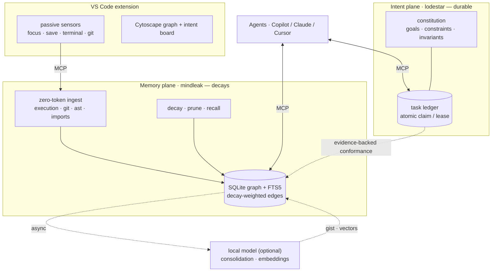

<p align="center">
  
</p>

# MindLeak

<p align="center">
  <a href="https://github.com/monk-eee/MindLeak/actions/workflows/ci.yml"></a>
  <a href="https://github.com/monk-eee/MindLeak/actions/workflows/release.yml"></a>
  <a href="https://github.com/monk-eee/MindLeak/releases"></a>
  <a href="LICENSE"></a>
  
  
</p>

**A local, decay-weighted context graph brain for coding agents.**

MindLeak is a **Temporal Context Graph Engine (TCGE)** that turns raw developer
telemetry (terminal runs, git commits, file symbols) into a directional knowledge
graph whose edges **decay on an exponential half-life**, so stale context fades
instead of drowning every query in historical noise.

MindLeak has **two planes**:

- a **Memory plane** — *what happened* and *how the code connects*, that
  **forgets on purpose**. It does structural, multi-hop reasoning
  (*"what breaks if I change this?"*) that similarity search can't, plus semantic
  recall and passive capture of runs / commits / edits. Core:
  [`mindleak-core`](crates/mindleak-core) (SQLite graph + FTS5, decay engine,
  zero-token deterministic ingestion, optional embedding recall + LLM
  consolidation); served by [`mindleak-mcp`](crates/mindleak-mcp) over MCP/stdio.
- an **Intent plane — Lodestar** — the **durable** "spec brain": a versioned
  constitution (goals · constraints · invariants) and a task ledger with
  **atomic claim/lease** coordination, so multiple agents work in parallel
  without clobbering each other, plus evidence-backed conformance checks. Core:
  [`lodestar-core`](crates/lodestar-core); served by
  [`lodestar-mcp`](crates/lodestar-mcp).

A **VS Code extension** ([`editors/vscode`](editors/vscode)) adds passive editor,
shell-execution, and Git sensors, a live Cytoscape graph visualizer, and an
intent board.

> **No editor required.** The two planes are plain stdio MCP servers, so they
> work with **any** MCP client on their own. You can run MindLeak entirely from
> the **GitHub Copilot CLI** (or Claude Desktop / Cursor) with no VS Code at all —
> the extension is an optional richer surface, not a requirement. See
> [Use it from the Copilot CLI](docs/QUICKSTART.md#github-copilot-cli--no-editor-required).

It is a from-scratch replacement for flat-log / vector-only agent memory. See
[`docs/SPEC.md`](docs/SPEC.md) for the design and [`docs/`](docs/) for the
architecture and development guides.

> **Zero-token write path.** Ingestion uses pure pattern matching (regex + path +
> exit code) — no LLM tokens. An optional local Ollama model only runs
> asynchronously to consolidate noise into high-level intent nodes.

**New here?** → **[Quickstart](docs/QUICKSTART.md)** (running in minutes) ·
**[Usage guide](docs/USAGE.md)** (how an agent uses the tools).

---

## Where everything is

| I want to… | Go to |
|---|---|
| **Get running fast** | **[docs/QUICKSTART.md](docs/QUICKSTART.md)** |
| **See a normal workflow (scenarios)** | **[docs/WALKTHROUGH.md](docs/WALKTHROUGH.md)** |
| **Learn how to use the tools** | **[docs/USAGE.md](docs/USAGE.md)** |
| Look up a specific tool | [docs/TOOLS.md](docs/TOOLS.md) |
| Author or upgrade a policy pack | [docs/POLICY-PACKS.md](docs/POLICY-PACKS.md) |
| Use the VS Code extension | [editors/vscode/README.md](editors/vscode/README.md) |
| **Use it from the Copilot CLI (no editor)** | **[docs/QUICKSTART.md](docs/QUICKSTART.md#github-copilot-cli--no-editor-required)** |
| Understand the design | [docs/SPEC.md](docs/SPEC.md) · [docs/ARCHITECTURE.md](docs/ARCHITECTURE.md) |
| Understand the *intent plane* (spec brain) | [docs/SPEC-INTENT.md](docs/SPEC-INTENT.md) · [docs/SPEC-CONSTITUTION.md](docs/SPEC-CONSTITUTION.md) · [ADR-0004](docs/adr/0004-intent-plane-spec-brain.md) |
| Set up & run locally | [DEVELOPERS.md](DEVELOPERS.md) |
| Contribute a change | [docs/CONTRIBUTING.md](docs/CONTRIBUTING.md) |
| Constraints for AI agents | [AGENTS.md](AGENTS.md) |
| Know *why* it's shaped this way | [RATIONALE.md](RATIONALE.md) · [docs/adr/](docs/adr/) |
| See what changed | [CHANGELOG.md](CHANGELOG.md) |
| Report a vulnerability | [SECURITY.md](SECURITY.md) |
| Know who owns what | [CODEOWNERS](CODEOWNERS) |

---

## Download

Tagged [GitHub Releases](https://github.com/monk-eee/MindLeak/releases) provide
one archive containing both MCP servers for each supported platform:

| Archive suffix | Platform |
|---|---|
| `windows-x64` | Windows x64 |
| `linux-x64` | Linux x64 (glibc) |
| `macos-x64` | macOS Intel |
| `macos-arm64` | macOS Apple Silicon |

Extract the archive, then run `node /path/to/extracted/install.mjs` from your
workspace: the dependency-free Node 20+ installer smoke-tests and registers both
servers without overwriting unrelated MCP entries. Before extracting, verify the
archive against the release's `SHA256SUMS` and its signed GitHub artifact
attestation. Each platform also publishes a targeted VSIX with both native
servers included. The binaries are not OS publisher-signed, so the operating
system may show a warning. Preview versions use tags such as `v0.1.0-preview.1`.

See **[docs/QUICKSTART.md](docs/QUICKSTART.md)** for the full
install-to-first-prompt walkthrough. Measured outcomes, supported
language/platform matrices, and limitations:
[`docs/RELEASE-NOTES.md`](docs/RELEASE-NOTES.md).

### First five minutes

Open the MindLeak activity-bar icon after installing the VSIX. The **Workspace**
view derives one current state from the two MCP servers; it does not keep a
second copy of graph or task data.

1. Confirm the Memory and Intent rows show the exact running server builds and
   the effective per-activation identity shared by both planes.
2. Open a source file and choose **Ingest active file** when the workspace is
   `ready_empty`.
3. Open the **Context Graph** from the next action to inspect the first useful
   file/symbol neighbourhood.
4. When Lodestar has actionable tasks or designs, the action switches to the
   appropriate Intent or Design Board.

No account, network service, Rust toolchain, embedding model, or chat model is
required for this path. Optional terminal/Git capture failures are named
separately and never present the deterministic core as offline. Headless MCP
clients can follow the same calls in [docs/USAGE.md](docs/USAGE.md#first-value-without-vs-code).

---

## Run the MCP server

```bash
# Inside Git, every linked worktree shares the clone's repository-id store.
./target/release/mindleak-mcp
```

It speaks newline-delimited JSON-RPC 2.0 (MCP) on stdio.

On first start, MindLeak writes a 128-bit `mindleak.repositoryId` to shared
local Git config and stores both planes beneath the platform-local, non-roaming
state root. Independent clones receive independent ids; linked worktrees share
one `graph.db` and `spec.db`. Use `storage_status` to inspect the exact id and
paths. `MINDLEAK_HOME` relocates the root; direct `MINDLEAK_DB` / `LODESTAR_DB`
overrides remain available for managed environments (ADR-0038).

### Register with an MCP client (VS Code / Copilot example)

`.vscode/mcp.json`:

```json
{
  "servers": {
    "mindleak": {
      "command": "${workspaceFolder}/target/release/mindleak-mcp",
      "env": {
        "MINDLEAK_AGENT": "copilot",
        "MINDLEAK_WORKSPACE": "${workspaceFolder}"
      }
    }
  }
}
```

`MINDLEAK_AGENT` is a human-readable base label, not an owner credential. The
client must mint one 128-bit lowercase-hex token, call `open_session` once, and
reuse that `session_id` on identity-bearing tools. The extension does this
automatically and shares one session across both planes (ADR-0030).

`open_session` also accepts optional `branch`, `head_sha`, `base`, and `dirty`
so a session can declare *where* it is working. The server records what you
declare and never inspects Git itself; declare nothing and everything behaves
exactly as before (ADR-0035).

For the **GitHub Copilot CLI**, the installer also writes
`.mindleak/copilot-mcp.json` (absolute paths, `mcpServers` schema); pass it with
`copilot --additional-mcp-config @.mindleak/copilot-mcp.json` (ADR-0033). See the
no-editor walkthrough below.

### Use it from the GitHub Copilot CLI — no editor required

MindLeak is just two stdio MCP servers, so it works from the **`copilot` CLI on
its own** — no VS Code, no extension. The release installer registers both planes
for the CLI: it writes `.mindleak/copilot-mcp.json` with absolute paths and the
`mcpServers` schema the CLI expects (the CLI does not expand VS Code's
`${workspaceFolder}`). From your project root:

```bash
# 1. Register both planes (writes .vscode/mcp.json AND .mindleak/copilot-mcp.json)
node /path/to/extracted/install.mjs --agent your-name

# 2. Start the CLI pointed at the MindLeak config
copilot --additional-mcp-config @.mindleak/copilot-mcp.json
```

To make it the machine-wide default instead, merge the same `mcpServers` block
into `~/.copilot/mcp-config.json` (honours `COPILOT_HOME`). Full walkthrough:
[docs/QUICKSTART.md](docs/QUICKSTART.md#github-copilot-cli--no-editor-required).

---

## MCP tools

The two servers expose a Memory Plane (`mindleak-mcp`) and an Intent Plane
(`lodestar-mcp`). The full per-tool reference — every tool, both planes —
is **[docs/TOOLS.md](docs/TOOLS.md)**.

For how they are used together in a real session, see
**[docs/USAGE.md](docs/USAGE.md)** and **[docs/WALKTHROUGH.md](docs/WALKTHROUGH.md)**.

---

## Optional local-LLM consolidation

The consolidator speaks the **OpenAI-compatible** `/v1/chat/completions` API, so
it works with Ollama's `/v1` endpoint, LM Studio, llama.cpp's server, or any
compatible host. Point it at your local server:

```bash
export MINDLEAK_LLM_URL="http://localhost:11434/v1"   # Ollama's OpenAI endpoint
export MINDLEAK_MODEL="glm4:9b"                        # or codegeex4:9b, qwen2.5-coder…
# export MINDLEAK_LLM_API_KEY="sk-…"                    # only for hosted servers
```

The consolidator ([`consolidate.rs`](crates/mindleak-core/src/consolidate.rs))
uses a strict JSON `response_format` to compress raw logs into a single `intent`
node via the `consolidate_session` tool. It is optional and never on the hot
path — it errors cleanly when no model is reachable.

Set `MINDLEAK_AUTONOMOUS_CONSOLIDATION=true` to opt in to ADR-0017's idle
worker. It uses a separate SQLite connection, waits 300 idle seconds by default,
attempts at most once per hour, and processes at most 20 expiring candidates.
Manual and idle signal consolidation share one SQLite-backed workspace lease and
attempt interval. Model inference happens before one optimistic transaction that
persists a bounded gist (without raw inputs) and acknowledges only unchanged raw
evidence. Pass outcomes appear in `telemetry_snapshot`; merely configuring a
model never enables autonomous spend.

---

## Architecture


```mermaid
flowchart TD
  A["Agents · Copilot / Claude / Cursor"]
  subgraph editor["VS Code extension"]
    S["passive sensors<br/>focus · save · terminal · git"]
    V["Cytoscape graph + intent board"]
  end
  subgraph memory["Memory plane · mindleak — decays"]
    I["zero-token ingest<br/>execution · git · ast · imports"]
    G[("SQLite graph + FTS5<br/>decay-weighted edges")]
    D["decay · prune · recall"]
  end
  subgraph intent["Intent plane · lodestar — durable"]
    C["constitution<br/>goals · constraints · invariants"]
    T[("task ledger<br/>atomic claim / lease")]
  end
  O["local model (optional)<br/>consolidation · embeddings"]

  A <-->|MCP| G
  A <-->|MCP| T
  S -->|MCP| I
  I --> G
  D --> G
  G -.async.-> O
  O -.gist · vectors.-> G
  C --- T
  T -. evidence-backed conformance .-> G
```

---

## Build

Requires Rust 1.75+, Node 18+, and VS Code 1.93+ for the extension.

```bash
# Both MCP servers
cargo build --release --locked -p mindleak-mcp -p lodestar-mcp

# Run the test suite
cargo test

# VS Code extension
cd editors/vscode
npm install
npm run compile
```

The server binaries land at `target/release/mindleak-mcp` and
`target/release/lodestar-mcp` (with `.exe` on Windows).

For the full local workflow (lint, format, pre-commit, CI), see
[`DEVELOPERS.md`](DEVELOPERS.md).

---

## Layout

```
crates/
  mindleak-core/   memory plane: db · model · decay · graph · ingest · consolidate
  mindleak-mcp/    stdio JSON-RPC MCP server
  lodestar-core/   intent plane: constitution · tasks (claim/lease) · conformance · knowledge
  lodestar-mcp/    stdio JSON-RPC MCP server
editors/
  vscode/          passive sensor + Cytoscape visualizer
docs/              SPEC · SPEC-INTENT · ARCHITECTURE · CONTRIBUTING
```

---

## License

MIT.
