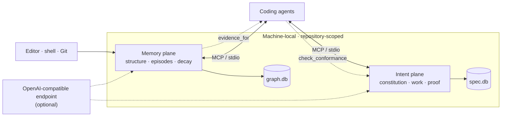

<p align="center">
  
</p>

# MindLeak

<p align="center">
  <a href="https://github.com/monk-eee/MindLeak/actions/workflows/ci.yml"></a>
  <a href="https://github.com/monk-eee/MindLeak/actions/workflows/release.yml"></a>
  <a href="https://github.com/monk-eee/MindLeak/releases"></a>
  <a href="LICENSE"></a>
  
  
</p>

**An operating system for agent coordination: shared memory, durable intent,
arbitrated work, and provable completion.**

MindLeak is the layer coding agents run on top of — not an agent and not a
model. It is local-first, and it gives a fleet a shared, repository-scoped
account of three things they routinely lose between prompts and parallel
worktrees:

1. **What happened and how the code connects.**
2. **What should happen, under which constraints, and why.**
3. **Who is doing the work and what evidence says about whether it matched the
  intent.**

It is useful with one agent and designed for the harder case: several agents
working concurrently in isolated worktrees without a shared understanding of
history, ownership, or completion.

**Start here:** **[Quickstart](docs/QUICKSTART.md)** to install it, then
**[Usage](docs/USAGE.md)** to see the operating loop or
**[Walkthrough](docs/WALKTHROUGH.md)** for concrete scenarios.

## The premise

Agent failures are often context failures rather than model failures. Event logs
accumulate without structure, similarity search retrieves plausible neighbours
without proving a dependency, governing intent drifts away from the files it
governs, and a completion summary is not evidence by itself.

MindLeak separates information by **lifetime** and **authority** instead of
putting everything in one memory store.

## Two planes, one loop

| Plane | Owns | Why it is separate |
|---|---|---|
| **Memory — MindLeak** | A directional graph of code structure, executions, commits, failures, and observations. Edges decay by derived effective weight; optional embeddings seed traversal rather than replace it. | Episodes and attention should fade. Structural multi-hop queries answer questions such as “what can this change affect?” that cosine similarity alone does not encode. |
| **Intent — Lodestar** | Versioned goals and constraints, reviewed designs, work claims and leases, fleet state, learned knowledge, and evidence-backed conformance. | Intent, decisions, and proof must outlive the episodes that produced them. |

Together they form one workflow:

```text
observe -> retrieve -> decide -> claim -> execute -> prove
```

The deterministic ingest and query path uses no model tokens or network calls.
Optional OpenAI-compatible models run off that path for consolidation and
semantic recall. Their outputs are derived rather than authoritative;
model-aware operations expose typed provenance or failure.

The coordination is **cooperative, not preemptive**. MindLeak is not a coding
agent, a filesystem lock, a sandbox, or a hosted memory service. Claims, leases,
and overlap warnings coordinate willing clients; they never stop a process from
writing to a file. Both planes are local stdio MCP servers and work without VS
Code. The extension adds passive sensors, graph and intent views, and packaged
native servers as an optional richer surface.

---

## Why this is different

| Common approach | MindLeak contract |
|---|---|
| Keep an ever-growing event log | Decay episodic edges by half-life and prune noise while retaining durable artifacts and intent. |
| Treat vector similarity as the answer | Use optional similarity only to find an entry point, then traverse explicit directional relationships. |
| Put current intent in prompts and prose | Version goals, constraints, designs, and their bindings to the artifacts they govern. |
| Coordinate agents through status messages | Use atomic claims, renewable leases, branch-aware overlap warnings, durable questions, and visible stalled work. |
| Accept “done” as narration | Check bounded, attributed execution and commit evidence against governing intent and preserve the verdict. |
| Let every worktree invent its own identity | Give linked worktrees one repository identity and shared local memory and intent stores while Git isolates their files. |

The distinction is not “graph instead of vectors.” It is a separation of
concerns: **similarity for recall, graph structure for consequence, decay for
relevance, constitution for authority, and evidence for completion.**

## What ships

- **`mindleak-mcp`** — temporal graph ingestion, impact and overlap queries,
  working context, optional semantic recall, bounded evidence bundles, and data
  lifecycle controls.
- **`lodestar-mcp`** — constitution and design governance, task and fleet
  coordination, learned knowledge, controls and waivers, conformance history,
  and portable proof export.
- **`mindleak-coordinator`** — a thin, optional stdio server composing both
  planes into one agent-facing entry point: one `open_session` for both, and
  one preflight combining MindLeak's and Lodestar's overlap/advice reads
  (ADR-0097, first slice).
- **VS Code extension** — both packaged native servers, passive editor/shell/Git
  sensors, readiness guidance, and graph, work, design, and telemetry views.
- **Headless setup** — generated MCP configuration for clients such as GitHub
  Copilot CLI; the servers remain ordinary newline-delimited MCP over stdio.
- **`clients/node/mindleak-client`** — a packaged, installable Node.js client
  for either MCP stdio server, so consumers no longer hand-write their own
  JSON-RPC framing (ADR-0103).

Together these are **MindLeak Core**, the local tier and the only tier that ships
today. *Ackplane* (the shared control plane) and *the Bridge* (assurance and
fleet operations) are accepted designs that are not yet built — see
[ADR-0082](docs/adr/0082-ackplane-is-a-standalone-federation-service.md) onward.
Inside Core each capability has a name and the question it answers: MindLeak
remembers, *Lodestar* holds intent, *Beacon* coordinates claims, *Gatekeeper*
governs, *Librarian* keeps evidence, and *Verifier* decides whether that
evidence proves conformance. They are capabilities, not separate products.

## Measured scope

In the pinned productization benchmark, three fresh runs per arm repaired one
composite typed-session scenario. No-memory and flat-history agents passed 0/3;
MindLeak passed 2/3; MindLeak with Lodestar passed 3/3. MindLeak reduced median
exploration calls by 18.2% against the no-memory arm.

That is evidence for the measured scenario, not a universal efficacy claim. The
full protocol, hidden checks, raw provenance, supported language matrix, and
known limitations are in [EVALUATION.md](docs/EVALUATION.md) and the current
[release notes](docs/RELEASE-NOTES.md).

## Get started

Download the archive for your platform from
[GitHub Releases](https://github.com/monk-eee/MindLeak/releases), verify it
against `SHA256SUMS` and the signed artifact attestation, extract it, then run
the dependency-free Node 20+ installer from your workspace:

```bash
node /path/to/extracted/install.mjs --agent your-name
```

The installer smoke-tests and registers both servers without overwriting
unrelated MCP entries. A matching VSIX provides the supported VS Code 1.101+
experience with no Rust toolchain or workspace MCP file required. For exact
platform steps and the first useful query, continue with the
**[Quickstart](docs/QUICKSTART.md)**.

## Trust boundaries

- **Local means machine-local and repository-scoped.** Both databases live in
  non-roaming user state, open no network listener, and are shared by linked
  worktrees through a repository id. MindLeak is not a cross-machine sync layer.
- **Model use is optional and explicit.** Deterministic ingest, traversal,
  coordination, and conformance do not require a model. Consolidation and
  embeddings call only the OpenAI-compatible endpoint an operator configures.
- **Coordination is advisory.** Claims, leases, overlap grades, and conformance
  findings make conflicts and drift visible; Git and protected-branch policy
  remain the enforcement boundary.
- **Static understanding is deliberately conservative.** Extraction is
  deterministic and heuristic. JavaScript/TypeScript has the richest cross-file
  model; Rust imports are supported; other languages are primarily file-local.
- **Local state is sensitive.** Graph and intent databases may contain source
  excerpts, commands, commit messages, terminal output, goals, and audit events.
  Read [Data lifecycle](docs/DATA-LIFECYCLE.md) before backup, export, or reset.

## Documentation

| Need | Read |
|---|---|
| Install and reach first value | [Quickstart](docs/QUICKSTART.md) |
| Operate the two-plane workflow | [Usage](docs/USAGE.md) and [Walkthrough](docs/WALKTHROUGH.md) |
| Look up an MCP tool | [Tool reference](docs/TOOLS.md) |
| Verify capabilities, limits, and results | [Release notes](docs/RELEASE-NOTES.md) and [Evaluation](docs/EVALUATION.md) |
| Understand temporal memory | [Memory specification](docs/SPEC.md) |
| Understand durable intent and governance | [Intent specification](docs/SPEC-INTENT.md) and [Constitution specification](docs/SPEC-CONSTITUTION.md) |
| Understand components and decisions | [Architecture](docs/ARCHITECTURE.md) and [ADRs](docs/adr/) |
| Operate data safely | [Data lifecycle](docs/DATA-LIFECYCLE.md) |
| Author policy | [Policy packs](docs/POLICY-PACKS.md) |
| Use the editor surface | [VS Code extension](editors/vscode/README.md) |
| Build a custom MCP client | [Node client SDK](clients/node/mindleak-client/README.md) |
| Build or contribute | [Developer guide](DEVELOPERS.md), [Contributing](docs/CONTRIBUTING.md), and [Agent constraints](AGENTS.md) |

## Architecture


```mermaid
flowchart LR
  S["Editor · shell · Git"] --> M
  A["Coding agents"] <-->|"MCP / stdio"| M
  A <-->|"MCP / stdio"| L

  subgraph local["Machine-local · repository-scoped"]
    M["Memory plane<br/>structure · episodes · decay"] --> G[("graph.db")]
    L["Intent plane<br/>constitution · work · proof"] --> D[("spec.db")]
  end

  M -. "evidence_for" .-> A
  A -. "check_conformance" .-> L
  O["OpenAI-compatible endpoint<br/>(optional)"] -.-> M
  O -.-> L
```

The planes share identity, and the client relays explicit evidence between their
MCP contracts; they do not share tables or a database. See
[Architecture](docs/ARCHITECTURE.md) for component boundaries and
[ADRs](docs/adr/) for the decisions behind them.

## Development

Start with [DEVELOPERS.md](DEVELOPERS.md) for the clean-machine build, validation,
and hook workflow. [CONTRIBUTING.md](docs/CONTRIBUTING.md) defines contribution
mechanics, [AGENTS.md](AGENTS.md) carries the non-negotiable constraints for
coding agents, and [RATIONALE.md](RATIONALE.md) explains why the repository is
shaped this way.

## License

MIT.
