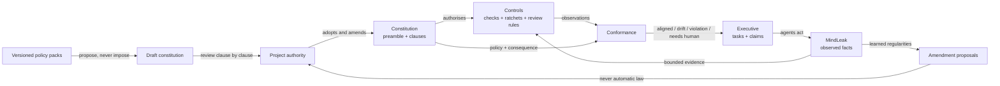

# Specification - Constitutional Governance

**Status:** Proposed design contract
**Scope:** Lodestar Constitution, Conformance, and repository onboarding
**Related decisions:** [ADR-0004](adr/0004-intent-plane-spec-brain.md),
[ADR-0009](adr/0009-evidence-backed-conformance.md), and
[ADR-0025](adr/0025-authoritative-checked-conformance.md)

This specification makes the Constitution, rather than a collection of quality
ratchets, the authority that governs a project. Ratchets remain useful, but only
as executable controls derived from an adopted policy. They can report that a
number moved; they cannot decide why the number matters, when an exception is
legitimate, or whether a different value should take priority.

The design also covers the ordinary adoption case: a repository starts with no
constitution, no dedicated policy team, and only scattered clues in its README,
CI, tests, ADRs, and working conventions. Lodestar must help that project form a
small legitimate constitution without silently imposing one.

---

## 1. Philosophy is part of the architecture

A governance system always embodies a philosophy, even when it pretends to be
only machinery. Hiding that philosophy in thresholds, defaults, or tool code
makes it harder to inspect and harder to change. Lodestar records it explicitly.

The design rests on six commitments:

1. **Purpose precedes mechanism.** A control exists to serve an articulated
   purpose. Passing the control is not the purpose of the project.
2. **Facts do not create obligations.** MindLeak can describe what a repository
   repeatedly does. That evidence may suggest an amendment, but repeated
   behaviour does not become law by observation alone. This preserves the
   boundary between *is* and *ought*.
3. **Legitimacy comes from adoption.** A common principle, generated draft, or
   organisation pack has no authority until an identified project authority
   adopts it. There is no hidden global constitution.
4. **Policy is contextual; evidence is concrete.** The Constitution states what
   should remain true and why. Controls gather reproducible facts. Conformance
   applies the former to the latter and explains the result.
5. **Governance is fallible and amendable.** Constitutional text is durable, not
   infallible. Change happens through attributed versions, explicit amendments,
   and reviewable exceptions rather than silent drift.
6. **Consequences are proportional and contestable.** Uncertainty asks for
   review. Only a sufficiently specific, active clause with adequate evidence
   can hard-block work. Every verdict points back to the clause, control, and
   evidence that produced it.

These commitments are not an ornamental preamble. They resolve ambiguity in the
rest of the design. In particular, they forbid automatic template activation,
policy inferred from telemetry, unexplained hard failures, and controls with no
governing clause.

## 2. The constitutional stack

The Constitution is a structured stack, not one undifferentiated document:

| Layer | Question | Authority and behaviour |
|---|---|---|
| **Preamble** | Why does this project exist, and how does it make trade-offs? | Interpretive; never emits a violation by itself. |
| **Principles** | What decision rules should normally guide the project? | Normative but broad; ambiguity leads to review, not an automatic hard block. |
| **Objectives** | What outcomes is the project pursuing? | Decomposes into Executive tasks. |
| **Constraints** | What boundaries apply within a stated scope? | Enforceable according to an explicit consequence and evidence contract. |
| **Invariants** | What must remain true without exception, or only under a declared waiver? | Hard policy when scope and evidence are satisfied. |
| **Controls** | What observable check supplies evidence for a clause? | Derived mechanism; has no independent authority. |
| **Conformance record** | Did this change comply, drift, violate policy, or require judgment? | Authoritative verdict with a resolvable evidence chain. |

The current `objective`, `constraint`, and `invariant` goal kinds remain the
normative core. The target model adds an explicit preamble and `principle` kind
so broad values are not misrepresented as mechanically enforceable invariants.

Every enforceable clause must state:

- its normative statement and rationale;
- the code, workflow, data, or project scope it governs;
- the evidence needed to evaluate it;
- the consequence of non-conformance (`advise`, `review`, or `block`);
- whether it is waivable, by whom, and for how long; and
- its local version and source provenance.

A clause missing scope, evidence, or consequence may guide a human review, but
it cannot directly produce `violation`.

## 3. Holistic control loop



This loop separates five responsibilities:

- **MindLeak describes** actual activity and preserves provenance.
- **The Constitution prescribes** legitimate intent and boundaries.
- **The Executive coordinates** who acts and when.
- **Controls measure** concrete conditions, including monotonic change.
- **Conformance judges** evidence under adopted policy and records why.

Learned knowledge may inform judgment or propose new clauses, but remains
advisory until adopted. This is the load-bearing distinction between a system
that learns and a system that quietly invents rules.

## 4. Ratchets are controls, not law

A ratchet compares an observed value with a reviewed baseline or prior accepted
value. Examples include "coverage must not decrease", "warning count must not
increase", and "p95 latency must not regress by more than 5 percent".

That mechanism is valuable but incomplete. A ratchet cannot determine:

- whether coverage is the right proxy for confidence;
- whether generated code is in scope;
- whether a security repair justifies a temporary performance regression;
- whether the baseline was trustworthy; or
- who can approve an exception and what remediation is required.

Therefore every ratchet must reference one active constitutional clause. Its
output is a **control observation**, not a verdict:

```text
ControlObservation {
  control_id, clause_id, control_version,
  scope, status: pass | fail | unknown,
  measurements, baseline, evidence_refs,
  evaluated_at
}
```

Conformance maps that observation through the clause's consequence. A failed
ratchet serving an advisory principle may request review; a failed ratchet
serving a hard invariant may produce `violation`. An orphaned, stale, or
out-of-scope control cannot hard-block work.

Controls may be deterministic checks, thresholds, ratchets, required procedures,
or bounded semantic judgments. The first implementation uses typed control
adapters, not a generic policy DSL, preserving ADR-0009's deliberately narrow
surface.

Controls are not limited to code checks. A **workflow control** observes a
procedural fact rather than a property of a changed file — for example, "this
change reached a protected branch through a reviewed merge rather than a direct
push". Branch-based development is the canonical illustration of the two
enforcement layers working together: the clause is a workflow-scoped rule
("development happens on branches; a protected branch advances only by reviewed
merge", with its rationale, consequence, and waiver policy), while the control is
the concrete mechanism that reports compliance — a client-side `pre-push` hook or
a server-side branch policy. The hook supplies the teeth that exist today; the
clause supplies the legitimacy and the bounded-waiver path for a justified
exception (a hotfix), instead of a silent `--no-verify` bypass. It is also the
first control whose scope is *workflow*, not a changed `artifact:`/`symbol:`
node, so conformance must resolve it by declared workflow scope rather than by
code bindings alone.

Lodestar ships a small **Common Core** as a versioned proposal pack. It is a
starting vocabulary, not universal law. Each project reviews every clause and
records `adopted`, `tailored`, or `rejected` with a reason.

The initial Common Core proposes five principles:

| Key | Proposed principle | Typical evidence or elaboration |
|---|---|---|
| `core.evidence` | Do not claim success without relevant, fresh evidence. | Tests, compile/lint results, benchmark or review evidence appropriate to risk. |
| `core.intent` | Preserve declared project intent and unrelated human work. | Scoped diffs, task/goal linkage, no unexplained destructive changes. |
| `core.safety` | Protect secrets, sensitive data, and the project's security boundary. | Secret scanning, threat-specific checks, reviewed security constraints. |
| `core.proportionality` | Keep change and validation proportional to impact and reversibility. | Impact radius, focused validation, broader checks for shared contracts. |
| `core.evolution` | Change policy through explicit amendment or bounded exception, never silent drift. | Version chain, attributed rationale, expiring waiver and remediation owner. |

These are intentionally principles rather than hard invariants. A project turns
them into enforceable constraints appropriate to its domain. For example,
`core.evidence` may elaborate into "all changed Rust crates pass clippy with
warnings denied" in one repository and a regulated release checklist in another.

Lodestar may also provide optional packs such as:

- `software-delivery`: build, test, dependency, documentation, and release
  policy candidates;
- language or framework packs such as `rust`, `typescript`, or `.net`;
- domain packs such as `local-first`, `service`, `library`, or `regulated-data`;
- organisation packs containing reviewed local policy; and
- repository-owned packs for related projects.

No pack is privileged by the engine. The Common Core is merely the recommended
first proposal.

## 6. Extension-pack contract

A policy pack is immutable, versioned input to drafting:

```text
ConstitutionPack {
  id, version, digest, title, description,
  compatible_engine_versions,
  preamble_fragments[], clauses[], conflicts[]
}

PackClause {
  key, kind, title, statement, rationale,
  default_scope, evidence_contract,
  default_consequence, suggested_controls[]
}
```

Composition happens at **proposal time**, not through live inheritance. On
adoption, a clause is materialised as a local, versioned constitutional clause
with source pack id, version, digest, and clause key. This gives each project a
self-contained constitution and prevents an upstream pack update from changing
local law silently.

Pack upgrades produce an amendment proposal showing added, removed, and changed
clauses. Existing local clauses remain active until the project reviews that
proposal. If two packs conflict, activation stops at `needs_human`; pack order
does not create hidden precedence.

Projects can extend a pack by adding local clauses, tailoring proposed clauses,
or publishing their local set as another pack. Rejection is a first-class,
recorded outcome, so the next bootstrap or upgrade does not repeatedly propose
a principle the project deliberately declined.

## 7. Onboarding a repository with no constitution

An absent constitution is a valid starting state, not implicit consent to the
Common Core.

### 7.1 Detect

`constitution_status` reports `absent`, `draft`, or `active`, including the
active version and unresolved draft decisions. When status is `absent`:

- MindLeak continues to provide descriptive memory;
- Lodestar may inventory the project and prepare drafts;
- no check may claim constitutional `aligned`; and
- conformance returns `needs_human` with `constitution_absent` when a caller asks
  for a policy verdict.

It must not return `violation`, because no project policy has legitimate
authority yet.

### 7.2 Discover facts

Bootstrap performs deterministic, read-only discovery over explicit repository
surfaces: `README`, `AGENTS.md`, contributing guidance, ADRs, manifests, CI,
linters, test configuration, ownership files, and existing quality gates.

Discovery produces cited **project facts**, never active clauses. An existing
CI threshold is evidence that the project uses a mechanism; it is not proof of
the reason, scope, or desired consequence. Ambiguous facts remain questions.

### 7.3 Propose

Lodestar combines:

1. a purpose and preamble draft grounded in project documentation;
2. the Common Core;
3. explicitly selected extension packs; and
4. candidate local clauses derived from cited repository facts.

Generated text is visibly marked as a proposal with source provenance. Optional
LLM assistance may summarise or phrase a draft, but activation and deterministic
discovery never depend on it.

### 7.4 Deliberate

A maintainer reviews each proposed clause as `adopt`, `tailor`, or `reject` and
resolves pack conflicts. The minimum viable constitution contains:

- a project purpose;
- an ordered trade-off philosophy or preamble;
- a disposition for every Common Core clause;
- at least one active objective;
- explicit amendment and exception authority; and
- a default evidence posture for review.

The project need not design every control before activation. Clauses without a
sufficient enforcement contract begin in review-only mode.

### 7.5 Baseline and activate

Before activation, controls run in inventory mode. Existing non-conformance is
made visible and handled explicitly by one of four honest choices:

- fix it before activation;
- narrow or tailor the clause;
- create an expiring waiver with an owner and remediation task; or
- reject the proposed clause.

There is no silent grandfathering. A ratchet may be chosen as the temporary
control that prevents a known gap from worsening, but the constitutional clause
and waiver explain why that transition policy is legitimate.

Activation is one attributed transaction that freezes the reviewed draft as a
new constitutional version. Only then can its clauses authorise hard verdicts.

### 7.6 Bind and improve

After activation, goals bind to code and workflow scopes, controls attach to
clauses, and conformance begins enforcing them. Observed gaps may create tasks or
amendment proposals. They never rewrite the active constitution automatically.

## 8. Conformance resolution

For each check, Lodestar resolves policy in this order:

1. Load the exact active constitutional version and valid scoped waivers.
2. Find active clauses governing the changed nodes and declared workflow scope.
3. Validate the evidence bundle under ADR-0009 and the live task claim.
4. Evaluate applicable typed controls and retain their observations.
5. Apply each clause's declared consequence.
6. Resolve broad principles or semantic ambiguity as `needs_human`.
7. Persist one authoritative result under ADR-0025.

The existing verdict meanings remain:

| Verdict | Constitutional meaning |
|---|---|
| `aligned` | Adequate evidence satisfies every applicable active clause, accounting for valid waivers. |
| `drift` | Work is outside its declared objective or governing scope, without evidence of a hard policy breach. |
| `violation` | Adequate evidence proves breach of an applicable hard clause with no valid waiver. |
| `needs_human` | The constitution is absent, evidence is insufficient, policy conflicts, or judgment is genuinely ambiguous. |

A template, learned regularity, broad principle, or model opinion can never
produce `violation` on its own.

## 9. Exceptions and amendments

An exception is not a hidden bypass. It is a scoped constitutional object:

```text
Waiver {
  id, clause_id, constitution_version,
  scope, reason, approved_by,
  created_at, expires_at,
  remediation_task_id, status
}
```

- The clause declares whether it is waivable and the required authority.
- A waiver is time-bounded. A permanent exception is an amendment.
- The conformance record names every waiver it applied.
- Expiry restores normal enforcement automatically; it does not mutate history.
- Revocation is attributed and immediate for future checks.

Amendments create a new constitutional version with rationale and an explicit
diff. Prior conformance records retain the version under which they were judged.

## 10. Target data contract

The implementation should evolve the current goal model without creating a
parallel source of truth:

```text
ConstitutionVersion {
  id, version, project_identity, purpose, preamble,
  status: draft | active | superseded,
  created_by, created_at, activated_by, activated_at
}

Clause {
  id, constitution_version, kind,
  title, statement, rationale, scope,
  evidence_contract, consequence,
  waivable, waiver_authority,
  source, status, superseded_by
}

ClauseSource {
  origin: local | pack | discovered,
  pack_id?, pack_version?, pack_digest?, clause_key?,
  disposition: adopted | tailored | rejected,
  disposition_reason
}

Control {
  id, clause_id, kind, version,
  configuration, status
}
```

Existing active goals migrate into the first local constitutional version with
`origin=local`. Migration does not invent a preamble, pack adoption, consequence,
or waiver policy; missing fields remain review-only until explicitly completed.

## 11. Target tool surface

The adoption workflow adds a small constitutional lifecycle around the existing
`define_goal`, `supersede_goal`, binding, and export tools:

1. `constitution_status()` - report absent/draft/active state and version.
2. `propose_constitution(packs?, project_profile?)` - discover facts and create
   a provenance-bearing draft; never activates it.
3. `review_clause(draft_id, clause_key, disposition, statement?, reason)` -
   adopt, tailor, or reject one proposal explicitly.
4. `activate_constitution(draft_id)` - validate the minimum constitution and
   activate one immutable version atomically.
5. `propose_pack_upgrade(pack_id, version)` - generate a reviewable amendment
   diff without changing active policy.
6. `grant_waiver(...)` / `revoke_waiver(...)` - manage bounded exceptions.

`get_constitution` and `export_constitution` must include the preamble, clauses,
source provenance, controls, active waivers, and version. Agents still read the
active constitution before acting.

## 12. Delivery phases

1. **Representation:** add constitution versions, preamble/principles, clause
   provenance, consequence, and review-only defaults; migrate current goals.
2. **Bootstrap:** ship the Common Core, deterministic project discovery, draft
   review, and atomic activation.
3. **Controls:** add typed control observations and bind existing
   `forbid_change` plus selected ratchets to clauses.
4. **Exceptions:** add waivers, amendment diffs, and version-aware audit output.
5. **Ecosystem:** publish pack schema validation, optional domain packs, and
   pack-upgrade proposals.

Each phase must preserve the existing evidence contract and authoritative
checked-completion protocol. No phase may make LLM access a prerequisite for
adoption, enforcement, or deterministic project operation.

### 12.1 Actionable backlog after acceptance

ADR-0026 is a design gate. While it remains `Proposed`, these items stay in this
specification and do not enter the claimable Executive board. Register the ADR
on the Design Board and obtain an attributed human acceptance first. Acceptance
materialises the following tasks under
`goal:durable-intent-plane-for-multi-agent-coordinatio` as a linear handoff
chain, because each task evolves the same schema, facade, conformance contract,
and documentation surface.

| Order | Task | Acceptance |
|---|---|---|
| 1 | **Add constitutional representation and migrate existing goals.** Introduce constitution versions, project purpose/preamble, `principle`, clause provenance, evidence contract, consequence, waiver policy, and lifecycle state. | Existing active goals migrate into the first local version without invented rationale or authority; incomplete clauses are review-only; absent/draft/active states and migrations are covered; callers move to the new model in the same change rather than through a compatibility fork. |
| 2 | **Implement immutable policy packs and the Common Core.** Add pack schema validation, content digest/version handling, conflict declarations, and the five Common Core proposals. | Pack adoption materialises self-contained local clauses with provenance; rejected dispositions persist; an upstream version change cannot alter active local policy; conflicting packs require review. |
| 3 | **Build deterministic repository bootstrap and activation.** Add `constitution_status`, fact discovery, `propose_constitution`, `review_clause`, and `activate_constitution`. | A fixture repository with no constitution reaches a cited draft; every Common Core clause has an adopt/tailor/reject disposition; activation is atomic and refuses unresolved/conflicting drafts; no model is required and no proposal activates itself. |
| 4 | **Bind typed controls and ratchets to clauses.** Add versioned `Control` and `ControlObservation` values, typed adapters, and clause-aware conformance resolution; migrate `forbid_change` as the first deterministic code control, add one reviewed ratchet, and add branch-based development (no direct push to a protected branch) as the first *workflow* control end to end. | A failed orphan control cannot block; the same observation maps to the consequence declared by its clause; a workflow control resolves by declared workflow scope rather than by code-node bindings; broad principles route to review; conformance audit/token records the constitutional version, clause, control version, and evidence used. |
| 5 | **Add amendments and bounded waivers.** Implement attributed constitutional versions, pack-upgrade proposals, `grant_waiver`, and `revoke_waiver`, including authority, scope, expiry, and remediation linkage. | Valid waivers affect only matching future checks and appear in the audit; expiry/revocation restores enforcement; permanent exceptions require an amendment; changed policy or waiver state invalidates a stale checked-conformance token. |
| 6 | **Prove adoption and publish the extension contract.** Run end-to-end pilots for an ungoverned fixture and a migrated governed repository; publish pack authoring/upgrade guidance and a self-contained constitution export. | Both adoption paths satisfy §13; exported policy includes philosophy, versions, provenance, controls, and active waivers; deterministic operation works without an LLM; focused and workspace validation are green and user-visible surfaces are documented. |

When the Design Board MCP surface is available, attributed human acceptance
followed by idempotent `promote_design` should create these six tasks with task 2
blocked by task 1, continuing through task 6. Do not model the policy itself as
completable tasks: principles, constraints, and invariants remain constitutional
clauses enforced continuously by Conformance.

### 12.2 Natural ADR scheduling

ADR scheduling is reconciliation, not a rule that every ADR must always create a
task. The extension scans structured ADR identity, title, and status metadata on
activation and file changes, and offers a manual **Sync ADRs** command. It does
not infer tasks from arbitrary Markdown.

| Repository ADR | Design state | Scheduling behaviour |
|---|---|---|
| New `Proposed` ADR | `proposed` | Register on the Design Board; create no task. |
| Accepted through the Design Board | `accepted` / `pending` | Offer `promote_design`; materialise tasks exactly once. |
| Historical accepted ADR | `accepted` / `not_required` | Import for audit; create no task unless a human explicitly requests promotion. |
| Rejected ADR | `rejected` | Retain for audit; never create tasks. |

`accept_design` records only the attributed human decision. The separate
`promote_design(design_id, objective_goal_id)` method reuses the planner behind
`decompose_goal`, then atomically stores the complete plan and design→task /
design→goal provenance. It is idempotent: retries return the existing materialised
result. Keeping promotion separate avoids holding a SQLite transaction across
optional model I/O and leaves a failed decomposition visibly pending and safely
retryable.

This distinction prevents first-time adoption from recreating work for old ADRs
whose implementation already shipped, while making every new proposed decision
naturally visible for review and every newly accepted implementation plan
traceable on the Executive board.

## 13. Acceptance properties

- A repository with no constitution is reported as ungoverned and is never
  silently judged against the Common Core.
- Bootstrap cites repository facts and creates only a draft.
- Every Common Core proposal has an explicit adopted, tailored, or rejected
  disposition before activation.
- Pack upgrades cannot change active policy without an attributed amendment.
- Every hard verdict resolves to an active clause, adequate evidence, and any
  control observation used.
- A ratchet with no active clause cannot hard-block work.
- Broad principles and uncertain semantic judgments route to human review.
- Valid waivers are scoped, attributed, expiring, and present in the audit.
- Learned knowledge can propose policy but cannot become policy automatically.
- The complete active constitution is exportable, diffable, and self-contained.

## 14. Non-goals

- A universal constitution imposed by MindLeak or Lodestar.
- A generic policy programming language in the first implementation.
- Automatic conversion of observed habits into enforceable policy.
- Remote policy distribution, signatures, or multi-machine authority hierarchy.
- Replacing tests, linters, security scanners, or quality ratchets; they become
  controls with explicit constitutional provenance.
