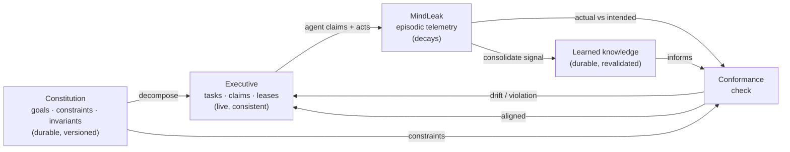

# Specification — Intent Plane (codename **Lodestar**)

> **Provisional name.** "Lodestar" (the fixed guiding star — durable intent that
> does not move) is a working title, contrasting with "MindLeak" (memory that
> leaks away). Alternative: **Canon** (the authoritative, versioned truth). The
> name lives only in docs until code lands; changing it is a find-and-replace.

**Role:** The **durable, authoritative** counterpart to MindLeak. Where MindLeak
is *episodic memory of the act* (descriptive, decaying, zero-token), Lodestar is
the *keeper of intent* (prescriptive, persistent, coordinating). It holds the
shared design specification, decomposes it into claimable tasks, and checks that
parallel agents' work conforms to the spec instead of diluting it.

> **MindLeak remembers what you did; Lodestar knows what you meant — and the loop
> between them is what stops the meaning from rotting.**

See [ADR-0004](adr/0004-intent-plane-spec-brain.md) for the decision and the
inverted-invariant argument; this document is the design contract.
Evidence crossing from MindLeak into conformance is governed by
[ADR-0009](adr/0009-evidence-backed-conformance.md).
The proposed constitutional authority hierarchy, philosophy, repository
onboarding, common core, and extension-pack contract are specified separately in
[SPEC-CONSTITUTION.md](SPEC-CONSTITUTION.md) and
[ADR-0026](adr/0026-constitutional-policy-over-mechanistic-ratchets.md).

---

## 1. Why a second plane (and three concerns, not two)

"Doing" and "intending" are different activities with different substrates —
that is why MindLeak decays and Lodestar must not. But "intent" itself splits
into two dynamics that must not share a substrate either, or the durable
constitution rots at the speed of the todo list:

| Plane | Analogue | Question | Dynamics |
|---|---|---|---|
| **Episodic** — MindLeak | hippocampus / working memory | "what just happened, what's hot?" | fast write, **decays** |
| **Constitution** — Lodestar | identity / values | "what are we building, what may we never violate?" | slow, **versioned, near-immutable** |
| **Executive** — Lodestar | prefrontal working plan | "who owns what, what's done, what's blocked?" | live, churny, **consistent + concurrent** |

The Constitution is the *why/what*; the Executive is the *who/when/status*. A
goal outlives ten thousand tasks. They reference each other but keep separate
lifetimes.

### 1.1 Constitutional authority (proposed)

The Constitution governs through adopted policy, not through a collection of
mechanical quality gates. Tests, scanners, thresholds, and ratchets remain
valuable, but they are subordinate controls: they produce evidence for a clause
and have no independent authority to block work.

A repository with no constitution begins **ungoverned**, not non-compliant and
not silently governed by Lodestar defaults. The proposed bootstrap flow discovers
cited project facts, combines them with an opt-in Common Core and selected
extension packs, then requires a maintainer to adopt, tailor, or reject each
proposal before activation. MindLeak observations and learned knowledge may
suggest amendments but can never turn repeated behaviour into law automatically.
Full contract: [SPEC-CONSTITUTION.md](SPEC-CONSTITUTION.md).

---

## 2. The control loop (how Lodestar uses MindLeak)

The planes are not silos; they form a perception–action loop with a reference
signal. MindLeak is the **sensor** that keeps intent honest — without live
telemetry, a spec is a static wishlist; with it, it is a conformance monitor.



Intent is set → an agent claims a task → it acts → MindLeak records what actually
happened (files changed, tests failed) → conformance diffs actual against the
constraints the touched code is bound by → **aligned** completes the task,
**drift/violation** blocks it and raises follow-up work.

MindLeak also feeds a **second** durable store: signal-weighted decay promotes
proven regularities into **learned knowledge** before the raw episodes fade — see
§5.

---

## 3. Topology

```
┌───────────────────────────────────────────────┐
│  Local brokering agents (Copilot / Claude /    │
│  Cursor / CLI) — many, in parallel, per worktree│
└───────┬───────────────────────────────┬────────┘
        │ MCP/stdio                      │ MCP/stdio
        ▼                                ▼
┌───────────────┐   loose seam    ┌───────────────┐
│  lodestar-mcp │  (node-id refs) │  mindleak-mcp │
└───────┬───────┘                 └───────┬───────┘
        ▼                                 ▼
  .lodestar/spec.db  (shared, WAL)   .mindleak/graph.db
  goals · tasks · links              nodes · edges (decay)
```

- **Shared store, many writers.** All agents and all worktrees of one repo open
  the **same** `spec.db`. SQLite in WAL mode gives concurrent readers plus a
  single serialised writer; coordination correctness comes from guarded
  transactions (§6), not from a daemon.
- **Worktree-agnostic path.** The DB lives at a stable per-repo location so
  worktrees share one plane. Resolution order:
  1. `LODESTAR_DB` if set;
  2. else the git *common* dir's parent (the main working tree root) →
     `<repo-root>/.lodestar/spec.db`;
  3. else `<cwd>/.lodestar/spec.db`.
- **No network, no auth.** `lodestar-mcp` is stdio-only, single-machine — the
  same boundary as MindLeak ([SPEC.md §8](SPEC.md)). Multi-machine is a separate,
  larger design (out of scope).
- **Loose seam.** Lodestar stores MindLeak node ids as opaque strings; the two
  databases never share tables or transactions.

---

## 4. Data model

Stable, human-readable ids, like MindLeak.

### Goal (the Constitution)

Durable and versioned. **Never decays.**

| Field | Meaning |
|---|---|
| `id` | `goal:<slug\|hash>` — e.g. `goal:zero-token-write-path` |
| `kind` | `objective` · `constraint` · `invariant` |
| `title` | short label |
| `statement` | the normative text (what must hold / be achieved) |
| `status` | `draft` · `active` · `superseded` |
| `version` | monotonic; supersede bumps it |
| `parent_id` | optional — goal hierarchy |
| `superseded_by` | id of the goal version that replaced this one |
| `created_at` | unix seconds |

`constraint` / `invariant` goals are what Conformance checks against (e.g. an
`invariant` mirroring "zero-token write path"). Superseding is the **only** way
intent changes — an explicit, attributed, auditable version bump, never silent
drift. That audit trail *is* the anti-dilution mechanism.

### Task (the Executive)

Live coordination state. Not versioned; churny.

| Field | Meaning |
|---|---|
| `id` | `task:<hash>` |
| `goal_id` | the goal this task serves |
| `parent_task_id` | optional — decomposition tree |
| `title` / `acceptance` | what "done" means |
| `status` | `open` · `claimed` · `in_review` · `done` · `blocked` · `abandoned` · `needs_input`† · `paused`† |
| `owner` | agent id holding the claim (from `MINDLEAK_AGENT` / `LODESTAR_AGENT`) |
| `claim_started_at` | start of the current owner's evidence window; lease renewal does not move it |
| `lease_expires_at` | unix seconds; a claim past this is reclaimable |
| `blocked_by` | optional task id |
| `created_at` / `updated_at` | unix seconds |

`create_task(..., blocked_by=<task>)` creates a blocked successor unless the
predecessor is already done. Only an evidence-backed aligned completion to
`done` clears direct dependencies, transactionally with the conformance record.
Dependencies are same-goal, acyclic, and one-to-one, forming linear handoff
chains. Claims/releases cannot bypass an unresolved dependency. This is the
supported progressive-handoff pattern for same-file edits: it serializes task
ownership without claiming symbol or filesystem locking (ADR-0015).
Durable `task_handoffs` lineage preserves the one-successor invariant after the
transient `blocked_by` field clears. Startup backfills legacy blocked tasks in one
transaction and fails closed if an old database contains ambiguous fan-out.

† **Parking states (proposed, [ADR-0020](adr/0020-task-lifecycle-states.md)).**
`needs_input` and `paused` are reachable only from `claimed` by the current owner
and both **clear the live lease while preserving `owner` and `claim_started_at`** —
deliberate parking, not release or abandonment. `needs_input` records a durable
question for a human and returns to `claimed` (same owner, fresh lease) when the
human answers; `paused` suspends work and returns to `claimed` on `resume`. Both
are non-terminal, sit off the `blocked_by` handoff path (a task must be `claimed`
to enter them, so a dependency is never bypassed), and — to prevent a vanished
owner stranding the task — become reclaimable to `open` after a bounded parking
grace distinct from the active lease. Coordination state, never decays
([ADR-0004](adr/0004-intent-plane-spec-brain.md)).

### Goal ↔ code (the seam)

`goal_code(goal_id, node_id, mode)` — links a goal to the MindLeak `artifact:` /
`symbol:` nodes that realise it. `mode` is `governed` by default;
`forbid_change` is available for constraints and invariants. Enables "which code
serves goal G?" and, in reverse, "which intent governs the file I'm about to
change?"

### Conformance record

`conformance(id, task_id, evidence_schema_version, evidence, verdict, findings,
checked_at)` where `verdict ∈ {aligned, drift, violation, needs_human}`. The
bounded, provenance-bearing evidence is retained with every verdict even after
its raw MindLeak episodes decay.

---

## 5. Learned knowledge & consolidation

The durable plane holds **two** kinds of content, not one: **authored intent**
(the Constitution, §4) and **learned knowledge** — regularities *discovered* from
episodic telemetry and promoted before they decay. Authored vs derived; both
durable; different provenance. This is the neocortex to MindLeak's hippocampus.

MindLeak's decay is not the enemy of hard-won experience — it is the **test
experience must keep passing.** The rule is **consolidate before decay**, driven
by *signal-weighted decay* ([ADR-0005](adr/0005-signal-weighted-decay.md)):
**decay the noise, keep the signal.**

### Learned-knowledge node

| Field | Meaning |
|---|---|
| `id` | `knowledge:<hash>` |
| `statement` | the distilled regularity (e.g. "changes to X break Y's tests") |
| `evidence` | provenance: the MindLeak node/edge ids that supported it, + count |
| `half_life` | **long but finite** — durable, not immortal (see below) |
| `confirmed_at` | last time fresh episodic evidence re-confirmed it |
| `created_at` | unix seconds |

### How signal is promoted (not laundered)

Consolidation is a lossy, semantic act, so promotion is **gated** — never
automatic:

- **Evidence + span thresholds** — a pattern must be reinforced across a *span*
  (weeks), not spammed in one session. Frequency alone is not signal; consequence
  and corroboration are.
- **Provenance** — every knowledge node records the episodes that support it, so
  the promotion is auditable and reversible.
- **Learned ≠ immortal.** Unlike the Constitution, learned knowledge carries a
  *long-but-finite* half-life and must be **re-confirmed** by fresh evidence, or
  it eventually fades. The Constitution is authored law and never decays; learned
  knowledge is earned and revalidated.
- **SLM-bounded, async, reviewable** — distillation runs off every hot path (§8),
  its quality is capped by the local model, and promotions are inspectable like
  the constitution export.
- **Advisory in conformance, never a hard block** — active knowledge informs a
  conformance check only as an *advisory finding* (at most nudging a verdict to
  `needs_human` so a human looks), never a `violation`; a decaying, revalidated
  regularity must not block valid work the way a Constitution `invariant` does.
  Promotion-from-signal and conformance-consumption wiring:
  [ADR-0022](adr/0022-learned-knowledge-loop.md).

The mechanism: when signal-weighted decay marks an episodic cluster as *proven
signal about to expire*, the consolidation worker distils it into a `knowledge:`
node with provenance, then lets the raw episodes decay. **Decay schedules the
learning; the signal term decides what survives it.**

---

## 6. Coordination — claim as a compare-and-swap

This is the load-bearing primitive. A claim must **hold**, so it is a guarded
transactional write, not a decaying edge. Claiming an open (or lease-expired)
task:

```sql
UPDATE tasks
   SET status = 'claimed',
       owner = :agent,
       claim_started_at = :now,
       lease_expires_at = :now + :ttl,
       updated_at = :now
 WHERE id = :task
   AND (status = 'open'
        OR (status = 'claimed' AND lease_expires_at < :now));
-- The winner is the transaction where changes() == 1. Everyone else lost.
```

- **Exactly one winner.** SQLite serialises writers; the `WHERE` guard is the
  compare-and-swap. Two agents racing for the same task → one `changes()==1`, the
  rest `0`. No collisions, no double work.
- **Leases with TTL.** A crashed agent's claim expires and the task becomes
  reclaimable — no work is stranded. `renew_lease` is a heartbeat for a
  still-live lease only and preserves `claim_started_at`. Once the lease lapses,
  renewal fails; the owner uses `claim_task` like any other contender, and a
  successful re-claim sets `claim_started_at` to the re-claim time so stale work
  cannot silently remain inside the conformance evidence window.
- **Completion is guarded too:** `… SET status='in_review' WHERE id=:task AND
  owner=:agent AND status='claimed'` — you can only complete what you still hold.

No cross-process locks beyond SQLite; WAL handles concurrent readers.

---

## 7. Conformance — the anti-dilution enforcement

MindLeak produces one versioned `ConformanceEvidence` bundle for an agent and
claim-bounded time window. Changed nodes come from mutation relations such as
`modified` and `refactored`; `observed` proves attribution, never mutation.
Lodestar validates the bundle without opening the MindLeak database.

> **Proposed constitutional resolution (ADR-0026).** Conformance first resolves
> the exact active constitutional version, governing clauses, and valid scoped
> waivers. Controls — including ratchets — contribute observations; the adopted
> clause determines their consequence. With no active constitution, policy
> judgment returns `needs_human`, never false alignment or violation.

Two tiers then run, mirroring MindLeak's "deterministic first, LLM optional"
posture:

- **Structural (deterministic, always on, zero-token):** missing or out-of-window
  evidence becomes `needs_human`; a `governed` node changed without a task for
  its goal becomes `drift`; changing an active `forbid_change` binding becomes
  `violation`; evidence matching the task goal passes the deterministic tier.
- **Semantic (optional local SLM):** "does this change contradict the *statement*
  of constraint C?" Uses a bounded evidence summary. An unavailable or uncertain
  model yields `needs_human`; it never fabricates alignment.

Only `aligned` completes a task. `drift` and `needs_human` remain `in_review`;
`violation` moves the task to `blocked`. `check_conformance` evaluates once and
persists an authoritative `{ id, token, verdict, findings }` result. The token
covers the exact evidence and relevant current intent/knowledge state.
`complete_task` verifies and consumes that checked result without invoking the
optional semantic judge again; changed evidence or state requires a new check.
The checked audit row is the sole durable evidence link controlling the atomic
transition. Full contract: [ADR-0009](adr/0009-evidence-backed-conformance.md),
as amended by [ADR-0025](adr/0025-authoritative-checked-conformance.md).

---

## 8. Optional local SLM

Same contract as MindLeak's `consolidate.rs`: an OpenAI-compatible
`/v1/chat/completions` call to a local server, JSON `response_format`, off every
hot path, nothing leaves the machine.

| Variable | Default | Meaning |
|---|---|---|
| `LODESTAR_LLM_URL` | `http://localhost:11434/v1` | OpenAI-compatible base URL |
| `LODESTAR_MODEL` | `glm4:9b` | model name |
| `LODESTAR_LLM_API_KEY` | *(empty)* | bearer token for hosted servers |

Used only for `decompose_goal` (goal → candidate tasks) and semantic conformance.
Both have deterministic fallbacks; the plane is fully functional with no model.

---

## 9. MCP tool surface

Newline-delimited JSON-RPC 2.0 over stdio, exactly like `mindleak-mcp`.

**Constitution**

1. `define_goal(title, statement, kind, parent?)` → `goal_id`.
2. `supersede_goal(goal_id, new_statement, reason)` → new `goal_id` (version bump).
3. `get_constitution(status="active")` → the authoritative goals/constraints an
   agent reads **before acting**.
4. `link_goal_to_code(goal_id, node_ids[], mode="governed")` → the seam to MindLeak.
5. `export_constitution(path?)` → write a committed, human-reviewable markdown
   snapshot (durability + PR review without any network infra).

**Executive**

6. `create_task(goal_id, title, acceptance, blocked_by?)` → `task_id`; a
  dependency opens automatically only after aligned predecessor completion.
7. `decompose_goal(goal_id)` → candidate tasks (SLM-assisted; deterministic stub
   otherwise). Objective goals only — constraints and invariants are enforced
   continuously by conformance, not broken into completable tasks.
8. `next_task(agent_id, capabilities?)` → a suggested unclaimed, unblocked task.
9. `claim_task(task_id, agent_id, lease_secs)` → `{ won, lease_expires_at }` (§6).
10. `renew_lease(task_id, agent_id, lease_secs)` → heartbeat.
11. `complete_task(task_id, agent_id, evidence, check)` → `blocked` /
  `in_review` / `done`; consumes the exact authoritative check and rejects it
  if evidence or relevant intent state changed.
12. `release_task(task_id, agent_id)` / `block_task(task_id, reason, blocked_by?)` /
  `reopen_task(task_id)` → return a stranded task (`in_review`, or a manual
  hold with no live predecessor gate) to claimable `open`; `abandon_task`
  durably retires open/review/blocked or expired-claim work without deleting
  its audit history. Both refuse to disturb live or parked ownership.
13. `board(include_terminal=true)` → coordination snapshot: every task, owner,
    status, lease — so humans and agents see the parallel state at a glance.
    `include_terminal=false` returns only the live/actionable set (open, claimed,
    needs_input, paused, in_review, blocked); done/abandoned stay durable but out
    of the operational view used by the VS Code Intent Board.

**Design**

14. `register_design(adr_path, title, summary?)` → one proposed design item.
15. `reconcile_designs(designs[])` → idempotently import structured ADR path,
  title, summary, and declared status. Reconciliation is deterministic: it
  never invokes a model or creates goals/tasks, and never overwrites an
  existing Design Board decision or promotion state.
16. `design_board()` → actionable design work: proposed items awaiting a human
  decision plus accepted items whose promotion is pending or retryable.
17. `accept_design(id, human)` / `reject_design(id, human, reason)` → attributed
  human decision; no code conformance and no self-acceptance.
18. `promote_design(id, objective_goal_id, constraints?)` → idempotently
  materialize tasks and mandated normative goals with durable provenance.

**Conformance**

19. `check_conformance(evidence, task_id?)` →
  `{ id, token, verdict, findings[] }`; persists one authoritative audit row.
20. `conformance_history(task_id)` → the append-only evidence chain for a task:
    each record's stable `id`, the recorded evidence bundle, `verdict`,
    `findings`, and `checked_at` — the durable, resolvable link proving how (and
    whether) a task reached completion.

---

## 10. Durability & git

The two concerns are version-controlled differently, matching their natures:

- **Constitution → committed.** `export_constitution` writes a human-readable
  markdown (e.g. `.lodestar/CONSTITUTION.md` or under `docs/`) that is checked in.
  Intent is then shared across worktrees and clones by git itself, reviewed in
  PRs, and diffable — the same way [AGENTS.md](AGENTS.md) already is, but
  machine-checkable and code-linked.
- **Executive → local, gitignored.** `spec.db` (tasks, claims, leases) is
  ephemeral coordination state, regenerable and machine-local; it is **not**
  committed. `.lodestar/` is gitignored except the exported constitution.

---

## 11. Security boundary

Identical posture to [SPEC.md §8](SPEC.md): stdio-only, single-user,
single-machine, unauthenticated **by design**. `spec.db` may contain design
intent and task notes; treat it with workspace sensitivity. No process opens a
socket. Any process with stdio access can write — acceptable locally, unsafe to
expose remotely; doing so would require an auth layer and its own ADR.

---

## 12. Phased plan (start small)

- **Phase 0 — MVP (shared intent + collision-free claiming).** `lodestar-core`
  crate + schema (`goals`, `tasks`, `goal_code`); `lodestar-mcp` with
  `define_goal`, `get_constitution`, `create_task`, `claim_task` (CAS + lease),
  `renew_lease`, `complete_task`, `board`. **Deterministic only, no LLM.** This
  alone lets parallel agents across worktrees share one spec and partition work
  without colliding.
- **Phase 1 — conformance + seam.** `link_goal_to_code`, deterministic
  `check_conformance`, `next_task` allocator, `export_constitution`.
- **Phase 2 — optional SLM.** `decompose_goal` and semantic conformance over the
  local model, with deterministic fallbacks.
- **Phase 3 — editor surface.** A VS Code board view (who owns what) and inline
  conformance warnings when a save touches goal-bound code.
- **Phase 4 — consolidation (learned knowledge).** Signal-weighted decay
  ([ADR-0005](adr/0005-signal-weighted-decay.md)) plus the sleep-phase worker
  that distils proven, about-to-expire episodic clusters into durable
  `knowledge:` nodes with provenance, revalidated on a long-but-finite half-life.
  Depends on the seam (Phase 1) and the SLM (Phase 2).

---

## 13. Testing requirements (non-negotiable)

Per [AGENTS.md](AGENTS.md), every tool ships with a test. The coordination core
demands specifically:

- **Claim concurrency:** two agents race one task → exactly one `won`, the DB
  shows one owner.
- **Lease expiry & reclaim:** an expired claim is re-claimable; a live claim is
  not stealable.
- **Completion guard:** a non-owner cannot complete or release a task.
- **Supersede chain:** superseding bumps version, marks the old `superseded`, and
  `get_constitution("active")` returns only the current set.
- **Conformance verdicts:** structural drift (goal-bound change with no task) and
  violation are detected; missing SLM degrades to `needs_human`, never blocks.
- **Consolidation gating:** a low-evidence / single-session pattern is **not**
  promoted; a proven, cross-span cluster is; learned knowledge revalidates on
  fresh evidence and fades without it.

---

## 14. Open questions

1. **Name:** Lodestar vs Canon (vs something else).
2. **Constitution source of truth:** primary-in-DB with markdown export (current
   plan), or primary-in-committed-file loaded into the DB?
3. **Task priority / ordering** model for `next_task` (FIFO, explicit priority,
   or goal-weighted).
4. **Semantic-violation policy:** does a low-confidence SLM `violation` hard-block
   completion, or only warn pending human review?
5. **Co-hosting:** keep `lodestar-mcp` separate, or expose both planes from one
   MCP server once stable?
